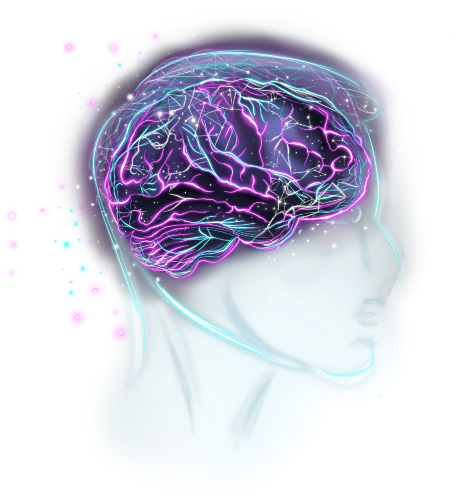

  

## Команда [Growth-Teams](http://growth-teams.ru)

### Дневник Эмоций

Мы предлагаем первый в России сервис для отслеживания ваших эмоций. Он базируется на искусственном интеллекте, который считывает эмоции по видео и определяет ваше настроение.

Дневник эмоций определяет ваше настроение за день, за последнюю неделю, месяц или год, анализирует эмоции и составляет для вас аналитику эмоционального состояния.

Мы сделали не просто сервис-дневник. Мы создали новый инструмент для улучшения качества вашей жизни. Аналитику и другие данные по своим эмоциям вы можете отправлять не только друзьям и близким, но и своему психологу, который на основе этих данных сможет более точно оценить ваше здоровье.

### Стек

  

    
    
    
  

  

    
    
    
    
  

### Запуск

1. `npm install` (node v14)
2. `npm start`
3. Перейти на http://localhost:4001/
